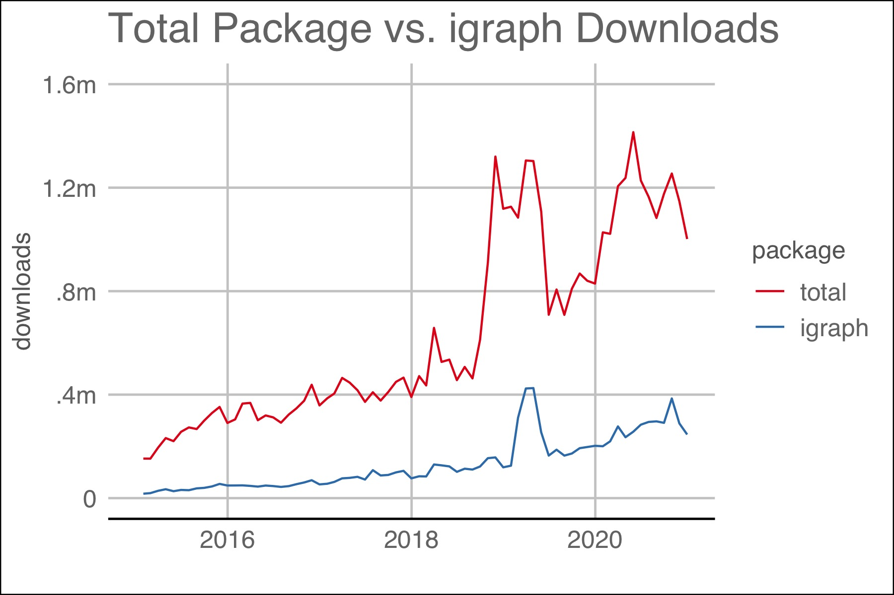
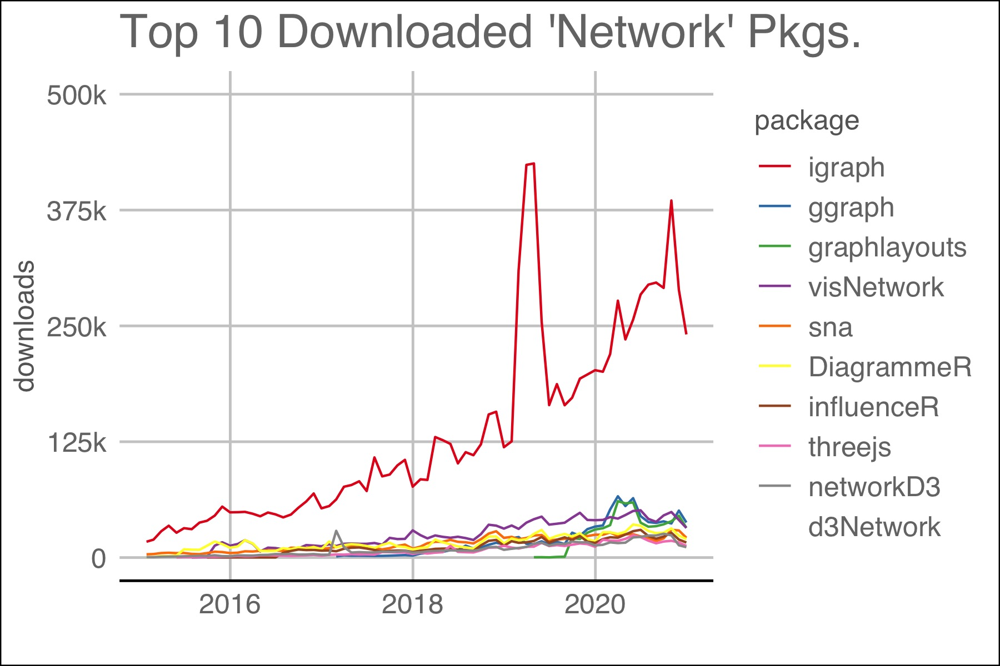

# (PART) The Basics {-} 

# Introduction {#intro}

```{r intro-libraries, include=F}
x <- c("magick", "igraph", "kableExtra", "knitr", "webshot", "tibble", "igraphdata")
sapply(x, library, character.only = T)
```

Package downloads are a proxy for the need for or the success of a package.  As of December, 2020, total packages for `R` numbered 16,851 and 385 packages used the word "network" in the title.  The latest monthly downloads yielded both total downloads and a clear leader in the area of network analysis:  `igraph`.  The two plots below show `igraph` downloads to other packages.

```{r r-package-downloads, echo=FALSE, fig.align = "center", fig.cap="The plot above shows the number of downloads for all packages and igraph.", out.width = '65%'}



```

```{r top-10-network-packages, echo = FALSE, fig.align = "center", fig.cap = "Top 10 packages with 'network' in their title.  Packages dealing with computer networks like 'RCurl' were omitted.", out.width="65%" }


```

## Terms

"A network is not just a metaphor: it is a precise, mathematical construct of nodes (vertices, actors) N and edges (ties, relations) E that can be directed or undirected. We can include information
(attributes) on the nodes as well as the edges." [@jasneyIntroductionSocialNetwork2018]

```{r node-graph, echo=FALSE, out.width="50%", fig.align="center", fig.cap="A network consisting of nodes, N, and directed edges E."}
library(igraph)
g1 <- graph_from_literal(a-+b, a+-c, b-+c)
V(g1)$color <- 1
V(g1)$color[2] <- 2
E(g1)$color <- 8
E(g1)$color[2] <- 3
E(g1)$lty <- 1
E(g1)$lty[2] <- 2
plot(g1, 
     vertex.size = 100,
     vertex.label.cex = 3,
     edge.width = 3)


```

## Input formats

Building a network graph is challenging because of the number of potential input types. Users must first distinguish whether the input is an adjacency matrix, incidence matrix, or edge list.  Then, the user must know if the graph is directed or undirected, weighted or unweighted. 
[@holtzNetworkGraphD32020]

### Adjacency matrix

An adjacency matrix is a square matrix where the number of rows and columns are the same. `igraph` can read an adjacency matrix using the `graph_from_adjacency_matrix()` function.  

```{r table-adjacency-matrix, echo=F, out.width="65%", fig.align="center", fig.cap="Network plot from adjacency matrix.  [@jasneyIntroductionSocialNetwork2018]"}

# Create df
set.seed(1)
data <- matrix(sample(0:2, 36, replace=TRUE, prob = c(.8, .1, .1)), nrow=6)
colnames(data) = rownames(data) = LETTERS[1:6]
#table
#print(data)
data %>%
  kbl(caption = "Adjacency Matrix. A '0' denotes no connection.") %>%
  kable_styling()
```

```{r plot-adjacency-matrix,echo=F, out.width="90%", fig.align="center", fig.cap="Network plot from adjacency matrix", fig.height=5}

# build the graph object
network <- graph_from_adjacency_matrix(data)
par(mar = c(1, 1, 1, 1))
# plot it
plot(network,
     vertex.size = 35,
     label.cex = 35
     )
```


### Sparse matrix

The function,  `graph_from_adjacency_matrix()`, also accepts a sparse matrix which is sometimes preferred to minimize file sizes and conserve system resources on large datasets.

```{r sample-sparse-matrix, echo=F}
library(Matrix)
my.m <- sample(x = c(0,1), size = 25, replace = T, prob = c(.5, .5))
my.m <- Matrix(my.m, nrow=5, ncol=5, byrow=FALSE, dimnames=NULL,
       sparse = TRUE, doDiag = TRUE, forceCheck = FALSE)
print(my.m)
```

```{r plot-sparse-matrix, echo=F, fig.align="center", fig.cap="Network plot from sparse matrix." }
network <- igraph::graph_from_adjacency_matrix(my.m)
par(mar = c(1, 1, 1, 1))
plot.igraph(network,
     vertex.size = 35,
     label.cex = 35)
```


### Incidence matrix

The rows and colunms of an incidence matrix do not have to be equal.  Its shape can be rectangular in addition to square. `igraph` can read an incidence matrix using the `graph_from_incidence_matrix()`.

```{r example-incidence-matrix, echo=F, fig.align="center", fig.cap="Incidency matrix."}
# data
set.seed(1)
data <- matrix(sample(0:2, 30, replace=TRUE), nrow=6)
colnames(data) <- letters[1:5]
rownames(data) <- LETTERS[1:6]
#
data %>%
        kbl(caption="Example incidency matrix.") %>%
        kable_styling("striped", "condensed", full_width = T) %>%
        column_spec(1, bold = T, border_right = T) %>%
        row_spec(0, bold = T)
```

```{r plot-incidence-matrix, echo = F, fig.align="center", fig.cap="Network plot from incidency matrix.", out.width="90%"}
# create the network object
network <- graph_from_incidence_matrix(data)
par(mfrow=c(1,1), mar=c(1, 1, 1, 1))
plot(network, 
     vertex.size = 35,
     label.cex = 35)
```

### Edge list

An edge list has 2 columns. Each observation represents a connection between two things.  The two column names are alternatively named (1) an origin and a destination or (2)a source and target, depending on the package used.  The column names are often the key to a successful importation of the data.  `igraph` imports an edge list `graph_from_edgelist()` function.

```{r table-edges-list, echo=F}
set.seed(1)
m <- sample(LETTERS[1:6], 18, replace = T)
m <- matrix(m, ncol =2)
colnames(m) <- c("origin", "destination")
#m <- dplyr::arrange(m, origin)

m1 <- as_tibble(m)
m1 %>%
        kbl(caption="Example Edgelist.") %>%
        kable_styling("striped", "condensed", full_width = T) %>%
        column_spec(1, bold = T, border_right = T) %>%
        row_spec(0, bold = T)
```

```{r plot-edgelist, echo=F, fig.align="center", fig.cap="Plot generated from edgelist.", out.width="90%", fig.topcaption = T}
# create the network object
network <- graph_from_edgelist(m)
par(mfrow=c(1,1), mar=c(1, 1, 1, 1))
plot.igraph(network, 
     vertex.size = 35,
     label.cex = 35, 
     arrow.mode = 0)
```

### Dataframe distinguished

"A data frame may for many purposes be regarded as a matrix with columns possibly of differing modes and attributes." [@rcoreteamIntroduction2020] In other words, a matrix must contain all of the same data type while a dataframe can have columns with differing data types -- numeric, character, factor, etc. Different authors and packages require one or the other and many coerce to the required data type internally without notification to the user. Matrices may offer greater computational efficiency although it may depend on the data types included. (find cite)

## Datasets

`igraphdata` contains a number of datasets that illustrate the use of network analysis.  The command `data(package="igraphdata")` lists the datasets available. After loading the package, `data("karate")` will load, for example, the "karate" dataset.

```{r igraph-datasets, echo=F}

dt <- data(package="igraphdata")$results[, 3:4]
dt <- as_tibble(dt)
dt %>% 
        kbl(caption="Datasets included in `igraphdata` package.") %>%
        kable_styling("striped", "condensed", full_width = T) %>%
        column_spec(1, bold = T, border_right = T) %>%
        row_spec(0, bold = T)
```

## Sanity Checks

A "sanity check" in coding is a method to determine if an error is the result of the code or the data used.  It's probably a safe presumption that a dataset resident within a package is formatted correctly.  However, it may be helpful to check user-built data structures in a program like [Gephi](https://gephi.org/) or [Cytoscope](https://cytoscape.org/). Both Gephi and Cytoscope require some familiarity before use.


