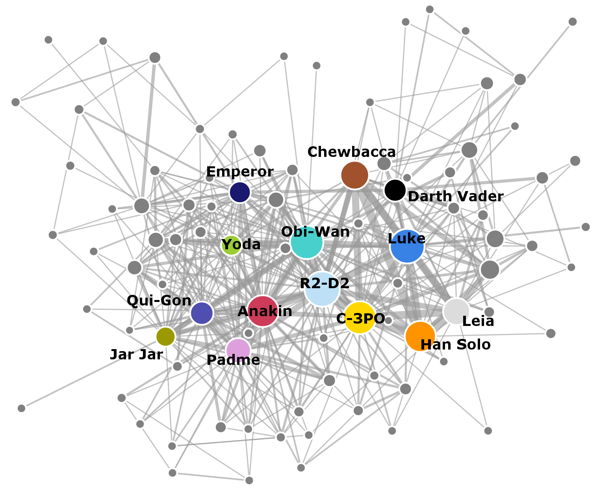

# (PART) Case Studies {-} 

# Case Study -- Star Wars {#starwars}

The coappearance of Star Wars characters across the  seven episodes was collected by data scientist Evelina Gabasova and her analysis can be found [here](http://evelinag.com/blog/2016/01-25-social-network-force-awakens/).  The individual nodes represent characters in the movies.  The characters are connected if they speak together in a scene.  The width of the edges is set by how much the characters speak to one another.  The size of each node represents the number of scenes that the characters appear in together.  Dr. Gabasova separated the two characters Darth Vader and Anakin from one another, yet combined Palpatine and Darth Sidious in a single node.  Amidala was merged with Padme. The data is available as a github [repo](https://github.com/evelinag/StarWars-social-network).[@gabasovaStarWarsSocial2016]

```{r gabasova-starwars-plot, echo=F, fig.align="center", out.width="65%", fig.cap="Gabasova's Starwars social network plot was prepared with D3.js"}



```

In this chapter, the above plot will be recreated using  the Star Wars dataset, all seven episodes, using `R` and `igraph`. The dataset was downloaded from the repo and is saved at `./data/gabasova/starwars-full-interactions-allCharacters.json`.

## Read Data

The data were stored in a `json` file and required importation using the `jsonlite` package. Once imported, the dataframes were clearly marked.  "Links" was changed to "edges". There were 112 characters in the seven Star Wars episodes with 450 character interactions.

```{r starwars-libraries, include = F}
#libraries
library(qgraph)
```

```{r starwars-read-data}
#import file
txt <- "./data/gabasova/starwars-full-interactions-allCharacters.json"
star.wars <- jsonlite::fromJSON(txt = txt)
#json was list of two databases:  nodes and edges
nodes <- star.wars$nodes
edges <- star.wars$links
```

## Graph object error

When the function `graph_from_data_frame()` was applied to the dataframe, an error message was displayed.

```{r star-wars-error, error = T}
#create graph object from dataframe--attempt 1
g <- igraph::graph_from_data_frame(d = edges,
                                   directed = F,
                                   vertices = nodes
                                   )
```

Upon creating a separate column labeled "id" and setting its value beginning with "0", the error did not repeat when the graph object was created.

```{r starwars-fix-error}
#Nodes--need to adjust column for 0-based index
nodes$id <- 0:111 #add id column
nodes <- dplyr::relocate(nodes, id, name, value, colour)
#create graph object from dataframe -- attempt 2
g <- igraph::graph_from_data_frame(d = edges,
                                   directed = F,
                                   vertices = nodes
                                   )
```

## Create attributes

Gabasova's original plot allowed for width to vary depending on the talk or conversation between the characters. The range of those conversations was between `r min(edges$value)` to `r max(edges$value)`.  Efforts to assign edge width based on the absolute values yield non-sensical widths.  Instead, a new attribute column was created by cutting the `value` column into six intervals.

```{r starwars-edge-attribute-column}
#Edges:  create column for edge.width attribute
edges$talk <- ggplot2::cut_interval(edges$value, 6)
levels(edges$talk) <- as.character(1:6)
edges$talk <- as.integer(edges$talk)
```

Additionally, in Gabasova's original plot, the size of the node varies with the number of scenes that the characters appear in together.  The nodes dataframe contains a column listed as `value`.  A new column was created for the `vertex.size` argument where the interval was cut into six equal sizes.

```{r starwars-node-attribute-column}
#Nodes:  create column for vertex.size attribute
nodes$scenes <- ggplot2::cut_interval(nodes$value, 6)
levels(nodes$scenes) <- 1:6
nodes$scenes <- as.character(nodes$scenes)
```

## Final plot

```{r starwars-create-graph-object, include=FALSE}
#convert to graph object from dataframe
g <- igraph::graph_from_data_frame(d = edges,
                                   directed = F,
                                   vertices = nodes
)
```

```{r starwars-final-plot-formatting}
#Create method to spread nodes
e <- edges[, c(1, 2)]#get.edgelist(g)
l <- qgraph.layout.fruchtermanreingold(e,vcount=vcount(g))
#plot the graph
par(mar = c(0,0,0,0))
plot(g, 
     layout = qgraph.layout.fruchtermanreingold(e,
                                                vcount = vcount(g),
                                                area = 8 * (vcount(g) ^ 1),
                                                repulse.rad = (vcount(g) ^ 1)
                                                ),
     vertex.color = vertex.attributes(g)$colour,
     vertex.label = ifelse(V(g)$value > 35, V(g)$name, NA),
     vertex.label.color = "black",
     vertex.label.cex = .6,
     vertex.label.font = 2,
     vertex.size = as.integer(vertex.attributes(g)$scenes) * 2,
     vertex.frame.color="white",
     edge.width = edge.attributes(g)$talk * 1,
     edge.color = "#D3D3D3",
     asp = 0
     )
```

## Summary

The Star Wars characters dataset is similar to the "Les Mis" dataset in that both track the coappearance of characters in famous artistic works one historic from 1584 and one contemporary beginning in 1977.  The Star Wars dataset offered more in terms of variables and the colour of the nodes was furnished.  The error discussed above was included as it occurs with some frequency that edges and vertices fail to match.  It is the subject of several questions on StackOverflow.  The entire script describe above is included in the repo as `./R/recreate_gabasova_star_wars_graph.R`

Overall, the graph as rendered in `igraph` matched most of the features of the `D3` graph by Gabasova.  One issue that was unresolved was the labels in `igraph` did not seem so allow the individual "tweaking" that occurred in the first chart.  Nonetheless, the Star Wars data allowed for many of the previous concepts to be applied and expanded, making it an excellent case study for skill development.
