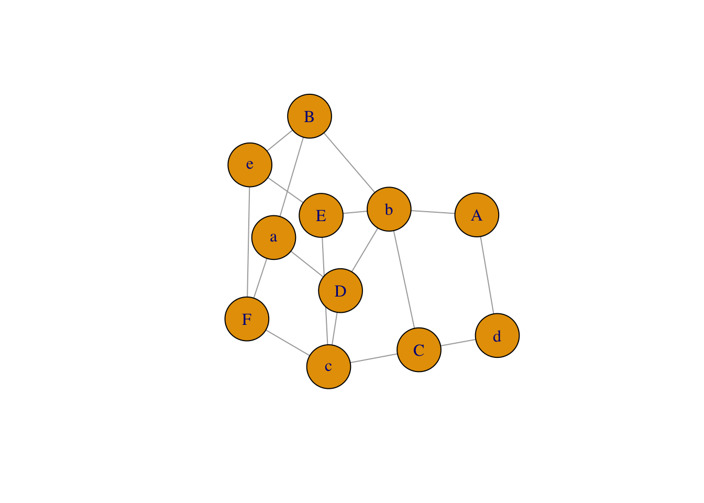

# Introduction {#intro}

## Terms

"A network is not just a metaphor: it is a precise, mathematical construct of nodes (vertices, actors) N and edges (ties, relations) E that can be directed or undirected." [@jasneyIntroductionSocialNetwork2018]

<!--html_preserve-->

<!--/html_preserve-->

(\#fig:node-graph)a node

## Input formats

Building a network graph is challenging because of the number of potential input types. Users must first distinguish whether the input is an adjacency matrix, incidence matrix, or edge list.  Then, the user must know if the graph is directed or undirected, weighted or unweighted. 
[@holtzNetworkGraphD32020]

### Adjacency matrix

An adjacency matrix is a square matrix where the number of rows and columns are the same. `igraph` can read an adjacency matrix using the `graph_from_adjacency_matrix()` function.

(\#fig:jasney-adjacency-matrix)Nodes with adjacency matrix.  [@jasneyIntroductionSocialNetwork2018]

### Incidence matrix

The rows and colunms of an incidence matrix do not have to be equal.  Its shape can be rectangular in addition to square. `igraph` can read an incidence matrix using the `graph_from_incidence_matrix()`.

<table class="table table-striped" style="margin-left: auto; margin-right: auto;">
 <thead>
  <tr>
   <th style="text-align:left;font-weight: bold;">   </th>
   <th style="text-align:right;font-weight: bold;"> a </th>
   <th style="text-align:right;font-weight: bold;"> b </th>
   <th style="text-align:right;font-weight: bold;"> c </th>
   <th style="text-align:right;font-weight: bold;"> d </th>
   <th style="text-align:right;font-weight: bold;"> e </th>
  </tr>
 </thead>
<tbody>
  <tr>
   <td style="text-align:left;font-weight: bold;border-right:1px solid;"> A </td>
   <td style="text-align:right;"> 0 </td>
   <td style="text-align:right;"> 2 </td>
   <td style="text-align:right;"> 0 </td>
   <td style="text-align:right;"> 2 </td>
   <td style="text-align:right;"> 0 </td>
  </tr>
  <tr>
   <td style="text-align:left;font-weight: bold;border-right:1px solid;"> B </td>
   <td style="text-align:right;"> 2 </td>
   <td style="text-align:right;"> 1 </td>
   <td style="text-align:right;"> 0 </td>
   <td style="text-align:right;"> 0 </td>
   <td style="text-align:right;"> 1 </td>
  </tr>
  <tr>
   <td style="text-align:left;font-weight: bold;border-right:1px solid;"> C </td>
   <td style="text-align:right;"> 0 </td>
   <td style="text-align:right;"> 1 </td>
   <td style="text-align:right;"> 1 </td>
   <td style="text-align:right;"> 2 </td>
   <td style="text-align:right;"> 0 </td>
  </tr>
  <tr>
   <td style="text-align:left;font-weight: bold;border-right:1px solid;"> D </td>
   <td style="text-align:right;"> 1 </td>
   <td style="text-align:right;"> 2 </td>
   <td style="text-align:right;"> 1 </td>
   <td style="text-align:right;"> 0 </td>
   <td style="text-align:right;"> 0 </td>
  </tr>
  <tr>
   <td style="text-align:left;font-weight: bold;border-right:1px solid;"> E </td>
   <td style="text-align:right;"> 0 </td>
   <td style="text-align:right;"> 2 </td>
   <td style="text-align:right;"> 1 </td>
   <td style="text-align:right;"> 0 </td>
   <td style="text-align:right;"> 1 </td>
  </tr>
  <tr>
   <td style="text-align:left;font-weight: bold;border-right:1px solid;"> F </td>
   <td style="text-align:right;"> 2 </td>
   <td style="text-align:right;"> 0 </td>
   <td style="text-align:right;"> 1 </td>
   <td style="text-align:right;"> 0 </td>
   <td style="text-align:right;"> 1 </td>
  </tr>
</tbody>
</table>

(\#fig:plot-incidence-matrix)Plot generated from incidency matrix.

### Edge list

An edge list has 2 columns. Each observation represents a connection between two things.  The two column names are alternatively named (1) an origin and a destination or (2)a source and target, depending on the package used.  The column names are often the key to a successful importation of the data.  `igraph` imports an edge list `graph_from_data_frame()` function.

(\#fig:jasney-incidence-matrix)Nodes with edge list.  [@jasneyIntroductionSocialNetwork2018]

### Dataframe distinguished

## R packages

Three `R` packages are dedicated to network analysis and are available for download from CRAN:  `igraph`, `ggraph`, and `networkD3`.

You can write citations, too. For example, we are using the **bookdown** package [@R-bookdown] in this sample book, which was built on top of R Markdown and **knitr** [@xie2015].
