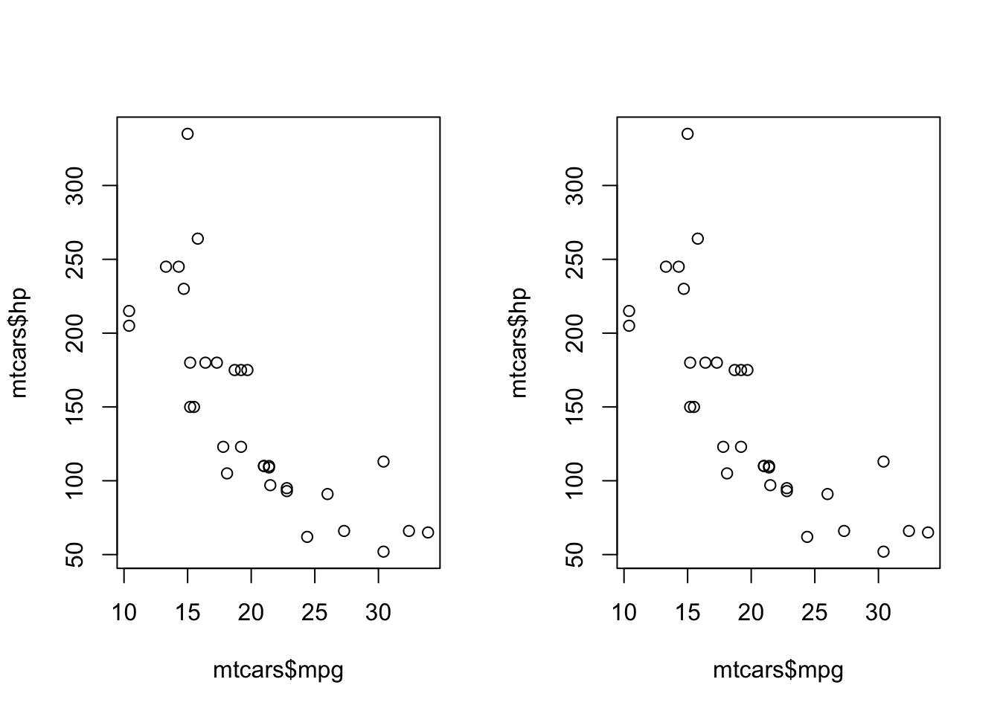

# Introduction {#intro}

## Terms

"A network is not just a metaphor: it is a precise, mathematical construct of nodes (vertices, actors) N and edges (ties, relations) E that can be directed or undirected." [@jasneyIntroductionSocialNetwork2018]

<div class="figure">
<!--html_preserve--><div id="htmlwidget-8fc1c574b97402535d3d" style="width:50%;height:480px;" class="grViz html-widget"></div>
<script type="application/json" data-for="htmlwidget-8fc1c574b97402535d3d">{"x":{"diagram":"digraph {\n\ngraph [layout = \"neato\",\n       outputorder = \"edgesfirst\",\n       bgcolor = \"white\"]\n\nnode [fontname = \"Helvetica\",\n      fontsize = \"10\",\n      shape = \"circle\",\n      fixedsize = \"true\",\n      width = \"0.5\",\n      style = \"filled\",\n      fillcolor = \"aliceblue\",\n      color = \"gray70\",\n      fontcolor = \"gray50\"]\n\nedge [fontname = \"Helvetica\",\n     fontsize = \"8\",\n     len = \"1.5\",\n     color = \"gray80\",\n     arrowsize = \"0.5\"]\n\n  \"1\" [label = \"N12\", fillcolor = \"#F0F8FF\", fontcolor = \"#000000\"] \n  \"2\" [label = \"N12\", fillcolor = \"#F0F8FF\", fontcolor = \"#000000\"] \n  \"3\" [label = \"N12\", fillcolor = \"#F0F8FF\", fontcolor = \"#000000\"] \n  \"4\" [label = \"N12\", fillcolor = \"#F0F8FF\", fontcolor = \"#000000\"] \n  \"5\" [label = \"N12\", fillcolor = \"#F0F8FF\", fontcolor = \"#000000\"] \n  \"6\" [label = \"N12\", fillcolor = \"#F0F8FF\", fontcolor = \"#000000\"] \n  \"7\" [label = \"N12\", fillcolor = \"#F0F8FF\", fontcolor = \"#000000\"] \n  \"8\" [label = \"N12\", fillcolor = \"#F0F8FF\", fontcolor = \"#000000\"] \n  \"9\" [label = \"N12\", fillcolor = \"#F0F8FF\", fontcolor = \"#000000\"] \n  \"10\" [label = \"N12\", fillcolor = \"#F0F8FF\", fontcolor = \"#000000\"] \n  \"11\" [label = \"N12\", fillcolor = \"#F0F8FF\", fontcolor = \"#000000\"] \n  \"12\" [label = \"N12\", fillcolor = \"#F0F8FF\", fontcolor = \"#000000\"] \n}","config":{"engine":"dot","options":null}},"evals":[],"jsHooks":[]}</script><!--/html_preserve-->
<p class="caption">(\#fig:node-graph)a node</p>
</div><div class="figure">
<!--html_preserve--><div id="htmlwidget-a6248975c4ee05005776" style="width:50%;height:480px;" class="visNetwork html-widget"></div>
<script type="application/json" data-for="htmlwidget-a6248975c4ee05005776">{"x":{"nodes":{"id":[1,2,3,4,5,6,7,8,9,10,11,12],"group":[null,null,null,null,null,null,null,null,null,null,null,null],"label":["N12","N12","N12","N12","N12","N12","N12","N12","N12","N12","N12","N12"]},"edges":{"id":[1,2,3,4,5,6,7,8,9,10,11,12],"from":[1,2,3,4,5,6,7,8,9,10,11,12],"to":[12,11,10,9,8,7,6,5,4,3,2,1],"label":["","","","","","","","","","","",""]},"nodesToDataframe":true,"edgesToDataframe":true,"options":{"width":"100%","height":"100%","nodes":{"shape":"dot"},"manipulation":{"enabled":false},"edges":{"arrows":{"to":{"enabled":true,"scaleFactor":1}}},"physics":{"solver":"barnesHut","stabilization":{"enabled":true,"onlyDynamicEdges":false,"fit":true}},"layout":{"improvedLayout":true}},"groups":[null],"width":null,"height":null,"idselection":{"enabled":false},"byselection":{"enabled":false},"main":null,"submain":null,"footer":null,"background":"rgba(0, 0, 0, 0)"},"evals":[],"jsHooks":[]}</script><!--/html_preserve-->
<p class="caption">(\#fig:node-graph)a node</p>
</div>


```r
df <- data.frame(nodes = c(1, 2), y = c(1, 1))
library(ggplot2)
p <- ggplot()
p <- p + geom_point(aes(1, 1), 
                    size = 25,
                    shape = 1,
                    label = "N1"
                    )
```

```
## Warning: Ignoring unknown parameters: label
```

```r
p <- p + annotate("text", x = 1, y = 1, label = "N1")

p <- p + theme_void()
p
```




## Input formats

Building a network graph is challenging because of the number of potential input types. Users must first distinguish whether the input is an adjacency matrix, incidence matrix, or edge list.

### Adjacency matrix

### Incidence matrix

### Edge list

### Dataframe distinguished

## R packages

Three `R` packages are dedicated to network analysis and are available for download from CRAN:  `igraph`, `ggraph`, and `networkD3`.


You can write citations, too. For example, we are using the **bookdown** package [@R-bookdown] in this sample book, which was built on top of R Markdown and **knitr** [@xie2015].
