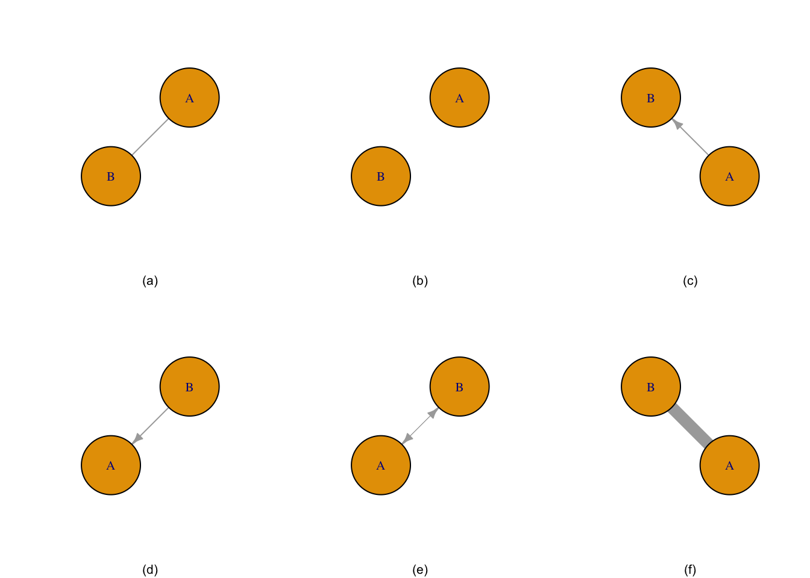
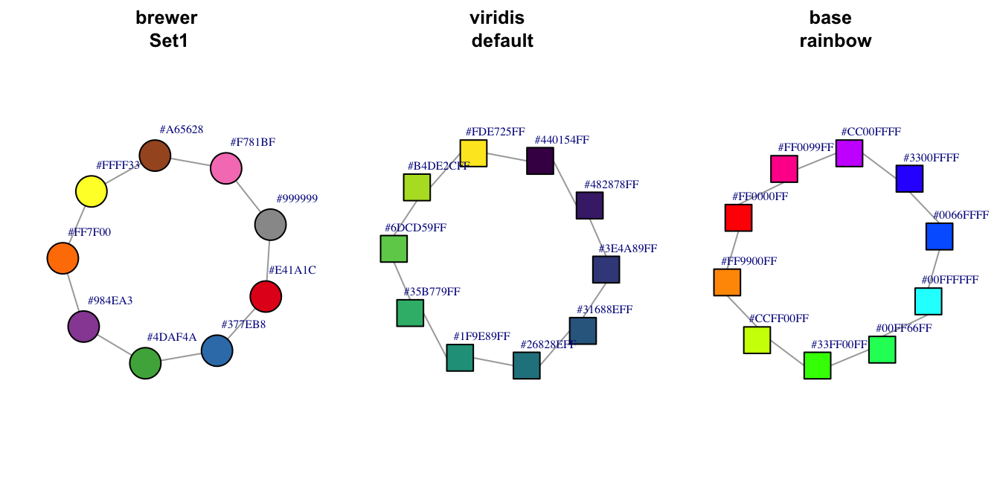
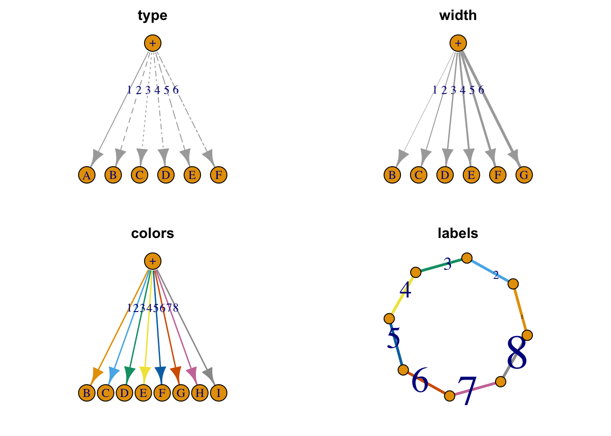

# igraph {#igraph}

`igraph` contains 773 functions. Three different plotting mechanisms exist: `igraph` for two dimensional plots, `tkplot` for interactive 2-dimensional plotting and `rglplot` which is for 3-dimensional plotting and is labeled as "experimental."

## Examples

### Simple

The simple graph below was created from manual entry using igraph's `graph_from_literal` function.

(\#fig:simple-igraph-node)Graph (a) is two nodes connected by edge, graph (b) is two unconnected nodes, graph (c) is two nodes with a directional edge, graph (d) is two nodes with the directional edge reversed, graph (e) is two nodes with a bidirectional edge, and graph (f) is two nodes connected by a weighted edge.

### Complicated

The complicated graph below was created from the Les Miserable resident dataset in `igraph`. The data contains 77 nodes and 254 edges.

(\#fig:complicated-igraph-node)Network graph of the coappearnce of characters in Les Miserable.

## Importation of Datasets

## Layout of Nodes

Nodes may be laid out in a variety of ways and many algorithms are available, depending on the data and the analyst's personal preference. "It is important to realize that the information in graph layouts is contained in the pattern of which nodes are connected to which others.  The locations . . . are chosen based on essentially aesthetic criteria." [@borgattiAnalyzingSocialNetworks2018] According to the igraph documentation, 21 available layouts are available and include:

<table class="table" style="margin-left: auto; margin-right: auto;">
<caption>(\#tab:layout-options-igraph)Available layouts for nodes in `igraph`.</caption>
<tbody>
  <tr>
   <td style="text-align:left;"> add_layout_ </td>
   <td style="text-align:left;"> component_wise </td>
   <td style="text-align:left;"> layout_as_star </td>
  </tr>
  <tr>
   <td style="text-align:left;"> layout_as_tree </td>
   <td style="text-align:left;"> layout_in_circle </td>
   <td style="text-align:left;"> layout_nicely </td>
  </tr>
  <tr>
   <td style="text-align:left;"> layout_on_grid </td>
   <td style="text-align:left;"> layout_on_sphere </td>
   <td style="text-align:left;"> layout_randomly </td>
  </tr>
  <tr>
   <td style="text-align:left;"> layout_with_dh </td>
   <td style="text-align:left;"> layout_with_fr </td>
   <td style="text-align:left;"> layout_with_gem </td>
  </tr>
  <tr>
   <td style="text-align:left;"> layout_with_graphopt </td>
   <td style="text-align:left;"> layout_with_kk </td>
   <td style="text-align:left;"> layout_with_lgl </td>
  </tr>
  <tr>
   <td style="text-align:left;"> layout_with_mds </td>
   <td style="text-align:left;"> layout_with_sugiyama </td>
   <td style="text-align:left;"> layout_ </td>
  </tr>
  <tr>
   <td style="text-align:left;"> merge_coords </td>
   <td style="text-align:left;"> norm_coords </td>
   <td style="text-align:left;"> normalize </td>
  </tr>
</tbody>
</table>

Plots were randomly generated from an adjacency matrix as illustrated by [R-graph-gallery](https://www.r-graph-gallery.com/network.html). The `layout_nicely` function is the default.  (verify).  The function 
uses the `layout_with_fr` with graphs less than 1,000 vertices and the `layout_with_drl` for graphs greater than 1,000 vertices.

(\#fig:igraph-mosaic-layout)Examples of available layouts.

## Attributes

Any chart is comprised of geoms.  `igraph` allows for the color, size, shape to be set in of two ways.  The first method is to supply named arguments to the plotting command, in the this case `plot.igraph`.

### Vertices

(\#fig:vertex-attributes)Selected node attributes.

(\#fig:more-color-examples)Additional node color palettes.

#### Shapes

#### Sizes

#### Colors

The argument to set the vertex color in the `plot.igraph` function is `vertex.color`.  Like plots in base `R`, color may be set by a number (integer) or name (character) with the name being preferred. The default palette can be retrieved through `?igraph::categorical_pal(n)`.  The colors are visible to those who are color-blind and is eight colors.

For plot.igraph and integer values, the default igraph palette is used (see the ‘palette’ parameter below. Note that this is different from the R palette.

If you don't want (some) vertices to have any color, supply NA as the color name.

The default value is “SkyBlue2”.

### Edges

(\#fig:edge-attributes)Selected edge attributes.

