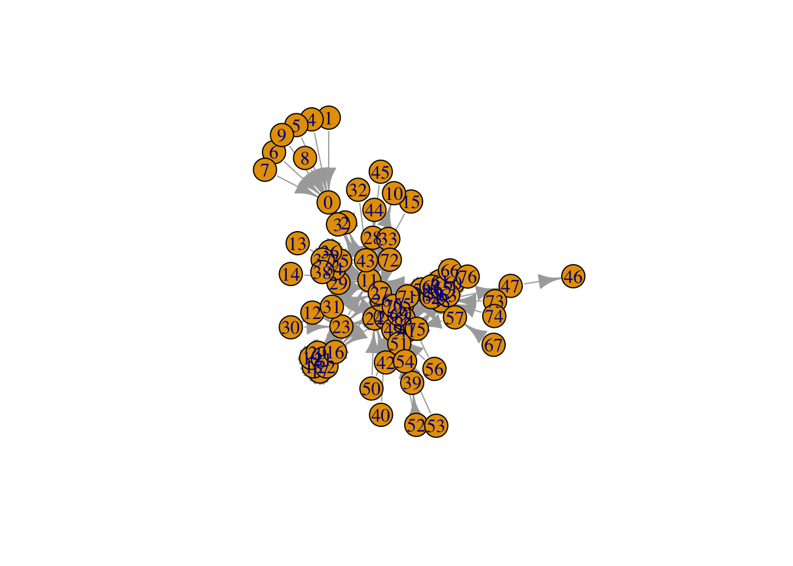
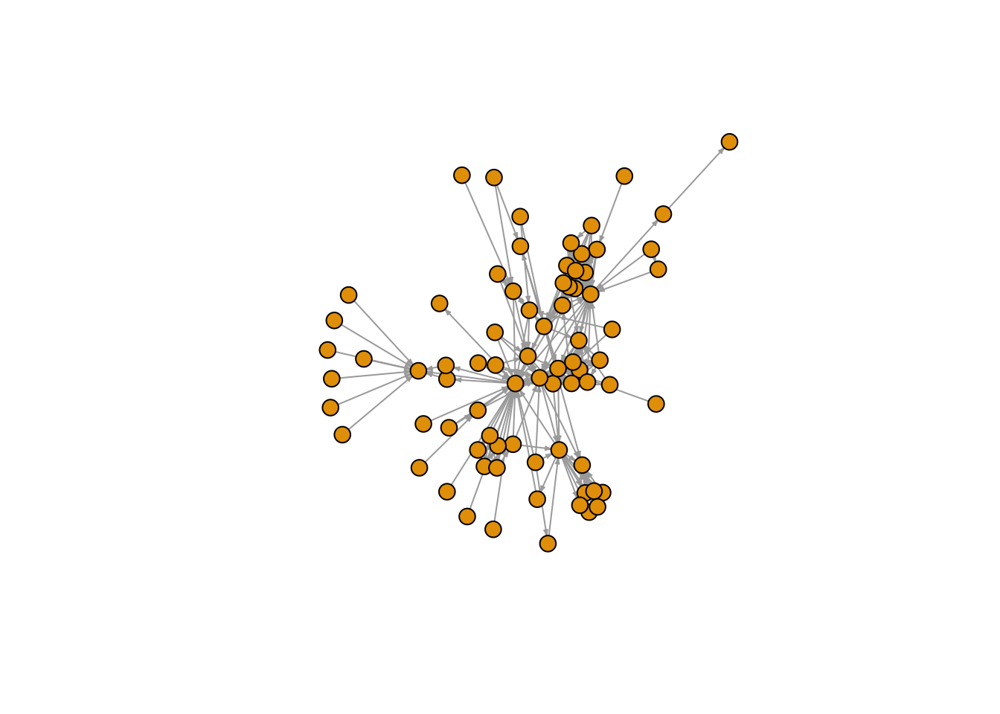

# First Graphs

## Les Miserable Dataset


```r
# Load igraph
library(igraph)

# Read data
lesmis <- read.csv("https://raw.githubusercontent.com/meefen/sna-ed/master/assets/lesmis/lesmis.csv")
# check the head (first 6 rows) of the dataset
head(lesmis)
```

```
##   Source Target weight
## 1      1      0      1
## 2      2      0      8
## 3      3      0     10
## 4      3      2      6
## 5      4      0      1
## 6      5      0      1
```

```r
# Create a graph using the graph_from_data_frame function
g <- graph_from_data_frame(lesmis)

# Plot the graph
plot(g)
```



```r
# make the graph a little prettier
plot(g, edge.arrow.size=.2, vertex.label=NA, vertex.size=8)
```



## Stop light


```r
library(sigmajs)
library(tibble)
```

```
## 
## Attaching package: 'tibble'
```

```
## The following object is masked from 'package:igraph':
## 
##     as_data_frame
```

```r
edges <- tibble(id = rep("1", 3),
                    source = rep("1", 3),
                    target = as.character(c(2:4))
                    )
nodes <- tibble(id = as.character(1:4),
                    label = c("light", "red", "yellow", "green"),
                    time = c(100, 30, 10, 20)
)
sigmajs() %>%
  sg_nodes(nodes, id, label, time) %>%
  sg_edges(edges, id, source, target) 
```

<!--html_preserve--><div id="htmlwidget-1f567fb66bb032c1a741" style="width:100%;height:480px;" class="sigmajs html-widget"></div>
<script type="application/json" data-for="htmlwidget-1f567fb66bb032c1a741">{"x":{"events":[],"kill":false,"data":{"nodes":[{"id":"1","label":"light","time":"100","x":"12.640181","y":" 3.843751"},{"id":"2","label":"red","time":" 30","x":"12.177734","y":"15.464822"},{"id":"3","label":"yellow","time":" 10","x":" 4.220843","y":"15.216751"},{"id":"4","label":"green","time":" 20","x":" 7.623199","y":" 8.922517"}],"edges":[{"id":"1","source":"1","target":"2"},{"id":"1","source":"1","target":"3"},{"id":"1","source":"1","target":"4"}]},"type":null,"button":[],"buttonevent":[],"crosstalk":{"crosstalk_key":null,"crosstalk_group":null}},"evals":[],"jsHooks":[]}</script><!--/html_preserve-->


## Les Miserabe

