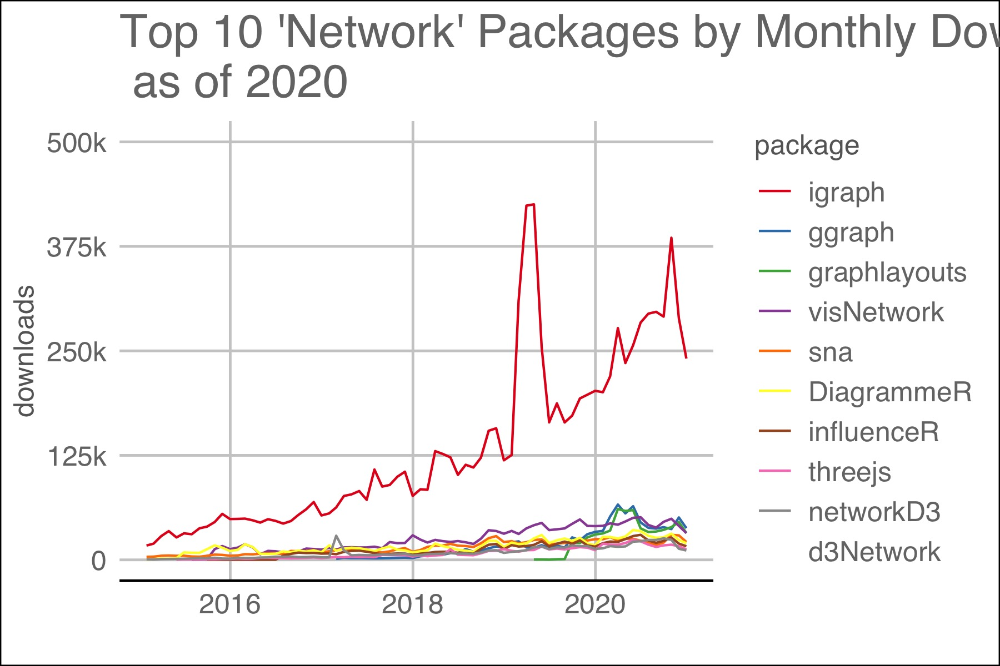

# Preface {-}

```{r setup, include=FALSE}
knitr::opts_chunk$set(echo = TRUE)
library(bookdown)
```

## Why Read this Book

Network analysis is a crucial strategy in understanding the direction and strength of connections between people, places and ideas. Visual representation of networks can speed the discovery process in working with data.

Package downloads are a proxy for the need for or the success of a package.  As of December, 2020, total packages for `R` numbered 16,851 and 385 packages used the word "network" in the title.  The latest monthly downloads yielded both total downloads and a clear leader in the area of network analysis:  `igraph`.  The two plots below show `igraph` downloads to other packages.

```{r r-package-downloads, echo=FALSE, fig.align = "center", fig.cap="The plot above shows the number of downloads for all packages and igraph.", out.width = '65%'}

knitr::include_graphics("./imgs/total_pkg_vs_igraph_downloads_2015-2021.jpg")

```
```{r top-10-network-packages, echo = FALSE, fig.align = "center", fig.cap = "Top 10 packages with 'network' in their title.  Packages dealing with computer networks like 'RCurl' were omitted.", out.width="65%" }


```


## Purpose

The purpose of this book is to speed the conversion of a traditional dataframe to a network diagram with nodes and vertices. Some discusson of basic computations will be included, but formulas are omitted unless necessary for understanding.  Network analysis is challenging partially due to its reliance on unfamiliar data structures.

## Collection

What follows is admittedly not the most original or insightful work on networks.  It is an attempt to collect tutorials from disparate packages, software and websites in a single place. Attribution will, of course, be given where known.

## Prerequisites

A working knowledge of `R` is necessary including how to obtain and load packages, how to manipulate basic data structures like lists and dataframes and how to plot and save graphs in multiple formats. Methods and packages in the `tidyverse` are preferred where available and  `Rstudio` is the development environment of choice.

## Disclaimer

I have no education or background in statistics, informatics or network analysis.  Reliance upon any representation within this publication should occur, if at all,  only after verification from other reliable sources and in consultation with someone with a relevant background.

## Acknowledgements

There were a number of helpful tutorials that deserve explicit mention and public acclaim.  The authors' differing perspectives gave context on how best to learn network analysis with `igraph`.  They include:

- [Katherine Ognyanova, Network Analysis and Visualization with R and igraph](https://kateto.net/networks-r-igraph)

- [Jesse Sadler, Introduction to Network Analysis with R](https://www.jessesadler.com/post/network-analysis-with-r/)

- [David Schoch, Basic Network Analysis in R: using igraph and related packages](http://mr.schochastics.net/netAnaR.html) 


